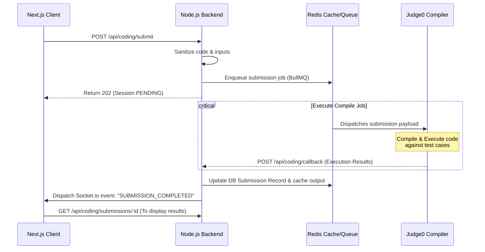

# AptiCode – System Architecture & High-Concurrency Specifications

This document defines the architectural components, network topologies, caching hierarchies, security controls, and infrastructure scaling blueprints required to support 100,000+ concurrent students on the AptiCode platform.

---

## 1. High-Level Architecture Diagram

```mermaid
graph TD
    Client[Web Client: Next.js + React] -->|HTTPS / WSS| CDN[Cloudflare CDN / Edge WAF]
    CDN -->|Static Assets / SSR Page Cache| Edge[Vercel Serverless / CDN Edge]
    CDN -->|API Requests| Gateway[AWS API Gateway]
    
    subgraph Core Application Layer (AWS EKS)
        Gateway -->|Load Balancer| AppCluster[Node.js Express App Cluster]
        AppCluster -->|Read / Write| PrimaryDB[(PostgreSQL Primary)]
        AppCluster -->|Read Only| ReadReplica[(PostgreSQL Read Replica)]
        AppCluster -->|Cache / Rate Limit / PubSub| Redis[(Redis Cluster)]
    end

    subgraph Internal Workers & Queues
        AppCluster -->|Enqueue Code Compilation| BullQueue[Redis-Backed Bull Queue]
        BullQueue -->|Job Pull| CompilerService[Judge0 API Cluster]
        AppCluster -->|Real-time Socket Notifications| SocketServer[Socket.io Scaleout Node]
    end

    subgraph Third-Party integrations
        AppCluster -->|Media Storage| Cloudinary[Cloudinary CDN]
        AppCluster -->|User Search Index| Algolia[Algolia Search Engine]
        AppCluster -->|AI Analysis / Prompts| AIService[Gemini & OpenAI API]
        AppCluster -->|Push Alerts| Firebase[Firebase Cloud Messaging]
    end
```

---

## 2. Dynamic Data Flows

### 2.1 Compiler Execution Flow


---

## 3. Caching Strategy (Redis Layering)

To maintain sub-100ms response times under heavy concurrent load, Redis is integrated across four distinct layers:

```
[Client Request]
       │
       ├──► 1. Rate Limiting Cache (Window checking) ──► Block if threshold exceeded
       │
       ├──► 2. Session / JWT Denylist ───────────────► Reject if token revoked
       │
       ├──► 3. Read Cache (Topics, Questions, IDE) ───► Return cached JSON directly
       │
       └──► 4. Leaderboard Sorted Sets ───────────────► Return ranks immediately
```

### 3.1 Leaderboard Sorted Sets (ZSet)
Ranks are updated in real-time. Instead of calling expensive SQL aggregation operations over millions of score records:
- **Write**: When a user gains XP, run `ZINCRBY leaderboard:weekly <score> <userId>`.
- **Read**: Fetching top 50 users is executed in $O(\log N + M)$ using `ZREVRANGE leaderboard:weekly 0 49 WITHSCORES`.

### 3.2 Question & Challenge Cache
Static aptitude questions and coding configurations are stored with a 24-hour expiration (`EXPIRE`).
* **Cache-Aside Pattern**: On query, check `redis.get("problem:" + id)`. If null, hit PostgreSQL database, store in Redis, and return.

---

## 4. High-Concurrency Scaling & Resilience Plan

To support **100k+ concurrent users** without outages, the system implements standard horizontal scaling principles:

### 4.1 Frontend Scaling (Next.js)
* **Static Site Generation (SSG)**: Landing page and landing grids are pre-compiled and served at Edge via Vercel.
* **Incremental Static Regeneration (ISR)**: Aptitude topic notes are updated in the background. Pages serve stale cache while compiling new data, preventing database hits.

### 4.2 Backend Auto-Scaling (AWS EKS / ECS Fargate)
* **Stateless Instances**: Express servers store zero local session state (session management uses secure signed JWTs and Redis cache).
* **Horizontal Pod Autoscaling (HPA)**: Pod instances auto-scale based on CPU utilization > 70% and memory footprint limit checks.

### 4.3 Database Optimization
* **Connection Pooling**: PgBouncer sits between Node.js cluster and PostgreSQL to manage active connections efficiently.
* **Read-Write Split**: Write operations hit Primary, while search queries, analytics reports, and public portfolios are directed to Read Replicas.

---

## 5. Security & Threat Mitigation

### 5.1 Infrastructure Hardening
* **Cloudflare WAF**: Shields from DDoS, SQL Injection, and cross-site scripting (XSS) at the network layer.
* **Rate-limiting (Express + Redis)**:
  * Global limits: Max 100 requests per minute per IP.
  * Auth endpoints (login/register): Max 5 requests per minute per IP.

### 5.2 Code Security Standards
* **SQL Injection**: Prisma ORM executes typed parameters natively. If raw queries are absolutely required, use Prisma `$queryRaw` with template literals (which parses parameter bindings).
* **XSS Prevention**: Monaco Editor inputs and resume fields are validated on input using libraries like `dompurify` and `express-validator` to strip malicious script payloads.
* **Security Headers**: Express uses `Helmet` middleware to configure HTTP headers:
  * `Content-Security-Policy` (CSP)
  * `X-Frame-Options` (Strict clickjacking shield)
  * `Strict-Transport-Security` (HSTS enforces HTTPS connections)
