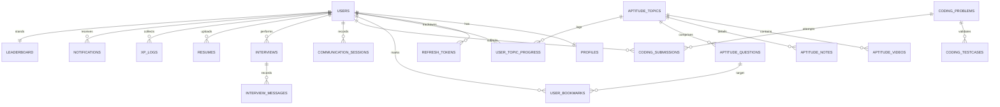

# AptiCode – Database Schema & ERD Specifications

This document defines the database structure, table definitions, relational models, primary and foreign key constraints, column validations, indexing strategy, and ER Diagram for the AptiCode platform.

---

## 1. Entity-Relationship Diagram (ERD)



---

## 2. PostgreSQL DDL Schema

Below is the complete PostgreSQL relational schema script, containing standard checks, relationships, and naming conventions.

```sql
-- -------------------------------------------------------------
-- Enums Setup
-- -------------------------------------------------------------
CREATE TYPE user_role AS ENUM ('STUDENT', 'ADMIN', 'OFFICER', 'TRAINER');
CREATE TYPE aptitude_category AS ENUM ('QUANTITATIVE', 'LOGICAL', 'VERBAL');
CREATE TYPE difficulty_level AS ENUM ('EASY', 'MEDIUM', 'HARD');
CREATE TYPE compile_status AS ENUM ('PENDING', 'ACCEPTED', 'WRONG_ANSWER', 'TIME_LIMIT_EXCEEDED', 'RUNTIME_ERROR', 'COMPILE_ERROR');
CREATE TYPE comm_session_type AS ENUM ('SPEAKING', 'READING', 'HR', 'GD');
CREATE TYPE interview_type AS ENUM ('HR', 'TECHNICAL', 'CODING', 'BEHAVIORAL');
CREATE TYPE chat_role AS ENUM ('INTERVIEWER', 'USER');

-- -------------------------------------------------------------
-- 1. Users Table
-- -------------------------------------------------------------
CREATE TABLE users (
    id UUID PRIMARY KEY DEFAULT gen_random_uuid(),
    email VARCHAR(255) UNIQUE NOT NULL,
    password_hash VARCHAR(255) NOT NULL,
    role user_role NOT NULL DEFAULT 'STUDENT',
    level INTEGER NOT NULL DEFAULT 1 CHECK (level >= 1 AND level <= 6),
    xp INTEGER NOT NULL DEFAULT 0 CHECK (xp >= 0),
    is_email_verified BOOLEAN NOT NULL DEFAULT FALSE,
    created_at TIMESTAMP WITH TIME ZONE DEFAULT CURRENT_TIMESTAMP,
    updated_at TIMESTAMP WITH TIME ZONE DEFAULT CURRENT_TIMESTAMP
);

-- -------------------------------------------------------------
-- 2. Profiles Table
-- -------------------------------------------------------------
CREATE TABLE profiles (
    id UUID PRIMARY KEY DEFAULT gen_random_uuid(),
    user_id UUID UNIQUE NOT NULL REFERENCES users(id) ON DELETE CASCADE,
    full_name VARCHAR(255) NOT NULL,
    college VARCHAR(255) NOT NULL,
    branch VARCHAR(100) NOT NULL,
    graduation_year INTEGER NOT NULL CHECK (graduation_year >= 2000),
    avatar_url TEXT,
    github_url TEXT,
    linkedin_url TEXT,
    placement_readiness_index INTEGER NOT NULL DEFAULT 0 CHECK (placement_readiness_index BETWEEN 0 AND 1000),
    created_at TIMESTAMP WITH TIME ZONE DEFAULT CURRENT_TIMESTAMP,
    updated_at TIMESTAMP WITH TIME ZONE DEFAULT CURRENT_TIMESTAMP
);

-- -------------------------------------------------------------
-- 3. Refresh Tokens Table
-- -------------------------------------------------------------
CREATE TABLE refresh_tokens (
    id UUID PRIMARY KEY DEFAULT gen_random_uuid(),
    user_id UUID NOT NULL REFERENCES users(id) ON DELETE CASCADE,
    token TEXT UNIQUE NOT NULL,
    expires_at TIMESTAMP WITH TIME ZONE NOT NULL,
    created_at TIMESTAMP WITH TIME ZONE DEFAULT CURRENT_TIMESTAMP
);

-- -------------------------------------------------------------
-- 4. Aptitude Topics Table
-- -------------------------------------------------------------
CREATE TABLE aptitude_topics (
    id UUID PRIMARY KEY DEFAULT gen_random_uuid(),
    name VARCHAR(255) UNIQUE NOT NULL,
    description TEXT,
    category aptitude_category NOT NULL,
    created_at TIMESTAMP WITH TIME ZONE DEFAULT CURRENT_TIMESTAMP
);

-- -------------------------------------------------------------
-- 5. Aptitude Videos Table
-- -------------------------------------------------------------
CREATE TABLE aptitude_videos (
    id UUID PRIMARY KEY DEFAULT gen_random_uuid(),
    topic_id UUID NOT NULL REFERENCES aptitude_topics(id) ON DELETE CASCADE,
    title VARCHAR(255) NOT NULL,
    url TEXT NOT NULL,
    duration INTEGER NOT NULL CHECK (duration > 0), -- in seconds
    youtube_video_id VARCHAR(50) NOT NULL,
    created_at TIMESTAMP WITH TIME ZONE DEFAULT CURRENT_TIMESTAMP
);

-- -------------------------------------------------------------
-- 6. Aptitude Notes Table
-- -------------------------------------------------------------
CREATE TABLE aptitude_notes (
    id UUID PRIMARY KEY DEFAULT gen_random_uuid(),
    topic_id UUID UNIQUE NOT NULL REFERENCES aptitude_topics(id) ON DELETE CASCADE,
    content TEXT NOT NULL, -- Markdown content
    created_at TIMESTAMP WITH TIME ZONE DEFAULT CURRENT_TIMESTAMP,
    updated_at TIMESTAMP WITH TIME ZONE DEFAULT CURRENT_TIMESTAMP
);

-- -------------------------------------------------------------
-- 7. Aptitude Questions Table
-- -------------------------------------------------------------
CREATE TABLE aptitude_questions (
    id UUID PRIMARY KEY DEFAULT gen_random_uuid(),
    topic_id UUID NOT NULL REFERENCES aptitude_topics(id) ON DELETE CASCADE,
    question_text TEXT NOT NULL,
    option_a TEXT NOT NULL,
    option_b TEXT NOT NULL,
    option_c TEXT NOT NULL,
    option_d TEXT NOT NULL,
    correct_option CHAR(1) NOT NULL CHECK (correct_option IN ('A', 'B', 'C', 'D')),
    explanation TEXT,
    difficulty difficulty_level NOT NULL DEFAULT 'MEDIUM',
    created_at TIMESTAMP WITH TIME ZONE DEFAULT CURRENT_TIMESTAMP
);

-- -------------------------------------------------------------
-- 8. Bookmarks Table
-- -------------------------------------------------------------
CREATE TABLE user_bookmarks (
    id UUID PRIMARY KEY DEFAULT gen_random_uuid(),
    user_id UUID NOT NULL REFERENCES users(id) ON DELETE CASCADE,
    question_id UUID NOT NULL REFERENCES aptitude_questions(id) ON DELETE CASCADE,
    created_at TIMESTAMP WITH TIME ZONE DEFAULT CURRENT_TIMESTAMP,
    UNIQUE(user_id, question_id)
);

-- -------------------------------------------------------------
-- 9. Topic Progress Table
-- -------------------------------------------------------------
CREATE TABLE user_topic_progress (
    id UUID PRIMARY KEY DEFAULT gen_random_uuid(),
    user_id UUID NOT NULL REFERENCES users(id) ON DELETE CASCADE,
    topic_id UUID NOT NULL REFERENCES aptitude_topics(id) ON DELETE CASCADE,
    videos_completed BOOLEAN DEFAULT FALSE,
    notes_completed BOOLEAN DEFAULT FALSE,
    quiz_score DECIMAL(5,2), -- Percentage score on associated tests
    completed_at TIMESTAMP WITH TIME ZONE,
    UNIQUE(user_id, topic_id)
);

-- -------------------------------------------------------------
-- 10. Coding Problems Table
-- -------------------------------------------------------------
CREATE TABLE coding_problems (
    id UUID PRIMARY KEY DEFAULT gen_random_uuid(),
    title VARCHAR(255) UNIQUE NOT NULL,
    description TEXT NOT NULL,
    time_limit_ms INTEGER NOT NULL DEFAULT 2000 CHECK (time_limit_ms > 0),
    memory_limit_kb INTEGER NOT NULL DEFAULT 262144 CHECK (memory_limit_kb > 0), -- default 256MB
    difficulty difficulty_level NOT NULL DEFAULT 'MEDIUM',
    editorial TEXT,
    created_at TIMESTAMP WITH TIME ZONE DEFAULT CURRENT_TIMESTAMP,
    updated_at TIMESTAMP WITH TIME ZONE DEFAULT CURRENT_TIMESTAMP
);

-- -------------------------------------------------------------
-- 11. Coding Testcases Table
-- -------------------------------------------------------------
CREATE TABLE coding_testcases (
    id UUID PRIMARY KEY DEFAULT gen_random_uuid(),
    problem_id UUID NOT NULL REFERENCES coding_problems(id) ON DELETE CASCADE,
    input_data TEXT NOT NULL,
    expected_output TEXT NOT NULL,
    is_hidden BOOLEAN NOT NULL DEFAULT TRUE,
    created_at TIMESTAMP WITH TIME ZONE DEFAULT CURRENT_TIMESTAMP
);

-- -------------------------------------------------------------
-- 12. Coding Submissions Table
-- -------------------------------------------------------------
CREATE TABLE coding_submissions (
    id UUID PRIMARY KEY DEFAULT gen_random_uuid(),
    user_id UUID NOT NULL REFERENCES users(id) ON DELETE CASCADE,
    problem_id UUID NOT NULL REFERENCES coding_problems(id) ON DELETE CASCADE,
    code_content TEXT NOT NULL,
    language VARCHAR(50) NOT NULL,
    status compile_status NOT NULL DEFAULT 'PENDING',
    execution_time_ms INTEGER CHECK (execution_time_ms >= 0),
    execution_memory_kb INTEGER CHECK (execution_memory_kb >= 0),
    created_at TIMESTAMP WITH TIME ZONE DEFAULT CURRENT_TIMESTAMP
);

-- -------------------------------------------------------------
-- 13. Communication Sessions Table
-- -------------------------------------------------------------
CREATE TABLE communication_sessions (
    id UUID PRIMARY KEY DEFAULT gen_random_uuid(),
    user_id UUID NOT NULL REFERENCES users(id) ON DELETE CASCADE,
    type comm_session_type NOT NULL,
    prompt_text TEXT NOT NULL,
    transcript TEXT NOT NULL,
    words_per_minute INTEGER CHECK (words_per_minute >= 0),
    grammar_score DECIMAL(5,2) CHECK (grammar_score BETWEEN 0.0 AND 100.0),
    fluency_score DECIMAL(5,2) CHECK (fluency_score BETWEEN 0.0 AND 100.0),
    confidence_score DECIMAL(5,2) CHECK (confidence_score BETWEEN 0.0 AND 100.0),
    feedback TEXT,
    created_at TIMESTAMP WITH TIME ZONE DEFAULT CURRENT_TIMESTAMP
);

-- -------------------------------------------------------------
-- 14. Interviews Table
-- -------------------------------------------------------------
CREATE TABLE interviews (
    id UUID PRIMARY KEY DEFAULT gen_random_uuid(),
    user_id UUID NOT NULL REFERENCES users(id) ON DELETE CASCADE,
    type interview_type NOT NULL,
    score DECIMAL(5,2) CHECK (score BETWEEN 0.0 AND 100.0),
    feedback_report TEXT,
    created_at TIMESTAMP WITH TIME ZONE DEFAULT CURRENT_TIMESTAMP
);

-- -------------------------------------------------------------
-- 15. Interview Messages Table
-- -------------------------------------------------------------
CREATE TABLE interview_messages (
    id UUID PRIMARY KEY DEFAULT gen_random_uuid(),
    interview_id UUID NOT NULL REFERENCES interviews(id) ON DELETE CASCADE,
    role chat_role NOT NULL,
    message_text TEXT NOT NULL,
    duration_seconds INTEGER CHECK (duration_seconds >= 0),
    audio_url TEXT,
    created_at TIMESTAMP WITH TIME ZONE DEFAULT CURRENT_TIMESTAMP
);

-- -------------------------------------------------------------
-- 16. Resumes Table
-- -------------------------------------------------------------
CREATE TABLE resumes (
    id UUID PRIMARY KEY DEFAULT gen_random_uuid(),
    user_id UUID NOT NULL REFERENCES users(id) ON DELETE CASCADE,
    file_url TEXT NOT NULL,
    content_json JSONB NOT NULL,
    ats_score INTEGER CHECK (ats_score BETWEEN 0 AND 100),
    feedback_report TEXT,
    created_at TIMESTAMP WITH TIME ZONE DEFAULT CURRENT_TIMESTAMP,
    updated_at TIMESTAMP WITH TIME ZONE DEFAULT CURRENT_TIMESTAMP
);

-- -------------------------------------------------------------
-- 17. Leaderboard Table
-- -------------------------------------------------------------
CREATE TABLE leaderboard (
    id UUID PRIMARY KEY DEFAULT gen_random_uuid(),
    user_id UUID UNIQUE NOT NULL REFERENCES users(id) ON DELETE CASCADE,
    weekly_score INTEGER NOT NULL DEFAULT 0 CHECK (weekly_score >= 0),
    total_score INTEGER NOT NULL DEFAULT 0 CHECK (total_score >= 0),
    rank INTEGER NOT NULL DEFAULT 0 CHECK (rank >= 0),
    updated_at TIMESTAMP WITH TIME ZONE DEFAULT CURRENT_TIMESTAMP
);

-- -------------------------------------------------------------
-- 18. XP Logs Table
-- -------------------------------------------------------------
CREATE TABLE xp_logs (
    id UUID PRIMARY KEY DEFAULT gen_random_uuid(),
    user_id UUID NOT NULL REFERENCES users(id) ON DELETE CASCADE,
    activity_type VARCHAR(100) NOT NULL,
    xp_gained INTEGER NOT NULL CHECK (xp_gained > 0),
    created_at TIMESTAMP WITH TIME ZONE DEFAULT CURRENT_TIMESTAMP
);

-- -------------------------------------------------------------
-- 19. Notifications Table
-- -------------------------------------------------------------
CREATE TABLE notifications (
    id UUID PRIMARY KEY DEFAULT gen_random_uuid(),
    user_id UUID NOT NULL REFERENCES users(id) ON DELETE CASCADE,
    title VARCHAR(255) NOT NULL,
    body TEXT NOT NULL,
    is_read BOOLEAN NOT NULL DEFAULT FALSE,
    created_at TIMESTAMP WITH TIME ZONE DEFAULT CURRENT_TIMESTAMP
);

-- -------------------------------------------------------------
-- Database Indexes (High Performance Operations)
-- -------------------------------------------------------------
CREATE INDEX idx_users_email ON users(email);
CREATE INDEX idx_profiles_user ON profiles(user_id);
CREATE INDEX idx_aptitude_questions_topic ON aptitude_questions(topic_id);
CREATE INDEX idx_user_bookmarks_user ON user_bookmarks(user_id);
CREATE INDEX idx_progress_user ON user_topic_progress(user_id);
CREATE INDEX idx_coding_testcases_problem ON coding_testcases(problem_id);
CREATE INDEX idx_coding_submissions_user_problem ON coding_submissions(user_id, problem_id);
CREATE INDEX idx_communication_sessions_user ON communication_sessions(user_id);
CREATE INDEX idx_interviews_user ON interviews(user_id);
CREATE INDEX idx_interview_messages_interview ON interview_messages(interview_id);
CREATE INDEX idx_resumes_user ON resumes(user_id);
CREATE INDEX idx_leaderboard_score_rank ON leaderboard(weekly_score DESC, rank ASC);
CREATE INDEX idx_xp_logs_user ON xp_logs(user_id);
CREATE INDEX idx_notifications_user_read ON notifications(user_id, is_read);
```

---

## 3. Custom Database Trigger (Automatic Leaderboard update)

To ensure the `leaderboard` and `users` tables maintain consistent status during user actions, this trigger handles automated scoring aggregation when XP is added.

```sql
CREATE OR REPLACE FUNCTION aggregate_user_xp()
RETURNS TRIGGER AS $$
BEGIN
    -- Update the User's overall XP and level ranking
    UPDATE users
    SET xp = xp + NEW.xp_gained
    WHERE id = NEW.user_id;

    -- Adjust user level dynamically based on new XP points
    UPDATE users
    SET level = CASE
        WHEN xp < 1000 THEN 1
        WHEN xp BETWEEN 1000 AND 2499 THEN 2
        WHEN xp BETWEEN 2500 AND 4999 THEN 3
        WHEN xp BETWEEN 5000 AND 9999 THEN 4
        WHEN xp BETWEEN 10000 AND 19999 THEN 5
        ELSE 6
    END
    WHERE id = NEW.user_id;

    -- Upsert stats into Leaderboard
    INSERT INTO leaderboard (user_id, total_score, weekly_score, updated_at)
    VALUES (NEW.user_id, NEW.xp_gained, NEW.xp_gained, CURRENT_TIMESTAMP)
    ON CONFLICT (user_id) DO UPDATE
    SET total_score = leaderboard.total_score + EXCLUDED.total_score,
        weekly_score = leaderboard.weekly_score + EXCLUDED.weekly_score,
        updated_at = CURRENT_TIMESTAMP;

    RETURN NEW;
END;
$$ LANGUAGE plpgsql;

CREATE TRIGGER trg_aggregate_xp
AFTER INSERT ON xp_logs
FOR EACH ROW
EXECUTE FUNCTION aggregate_user_xp();
```
